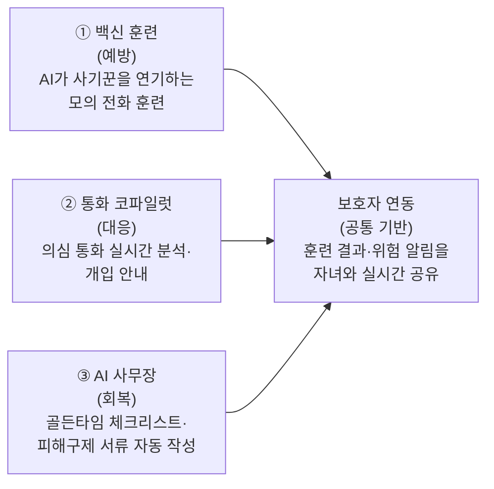

# PRD — 백신콜: 가족 연동형 보이스피싱 예방·대응·회복 AI

- **문서 목적**: 2026 금융 AI Challenge 출품작의 제품 요구사항 정의. 무엇을, 누구를 위해, 어떤 우선순위로 만드는지 답한다.
- **작성일**: 2026-07-22 · **상태**: 초안
- **관련 문서**: [문제정의](./problem-definition.md) (왜 만드는가) · 기능명세서(작성 예정, 대회 제출물)

---

## 1. 개요

### 한 문장 소개

> **"AI가 사기꾼을 연기해 부모님께 예방주사를 놓고, 진짜 사기 전화가 오면 실시간으로 곁을 지키고, 피해가 나면 서류와 절차를 대신 완주해주는 — 자녀와 함께 쓰는 보이스피싱 전 주기 방어 웹서비스"**

| 항목 | 내용 |
| --- | --- |
| 서비스명 | **백신콜** — "사기 전화, 미리 맞는 예방주사" |
| 형태 | 모바일 우선 반응형 **웹서비스** — 설치 불필요, iOS/안드로이드 무관 |
| 대상 사용자 | **부모(피보호자)**: 50~70대, 스마트폰은 쓰지만 디지털 금융에 서툰 계층 / **자녀(보호자)**: 30~40대, 부모의 디지털 격차를 대신 메워주는 가족 |
| 핵심 차별점 | ① 국내 유일의 **능동 예방(모의 훈련)** ② 사기 **진행 중** 개입 ③ **가족 연동** — 기존 서비스는 전부 개인 단위·사후 대응 |
| 대회 맥락 | 2026 금융 AI Challenge — **2026-09-07(월) 10:00** 기획서 PDF + 기능명세서 PDF + 배포 URL 제출. **URL은 9/7 11:00 ~ 9/11 23:59 동안 정상 작동 필수(불가 시 결격)** |

### 세 가지 축 (예방 → 대응 → 회복)

## 2. 목표와 성공 기준

### 제품 목표

1. 부모가 모의 사기 전화를 **몸으로 경험**하고, 자신의 취약 유형을 알게 된다.
2. 의심 전화 상황에서 부모 혼자 판단하지 않게 된다 — AI와 자녀가 실시간으로 곁에 있다.
3. 피해 발생 시 골든타임 절차(지급정지 → 신고 → 3영업일 내 서면 신청)를 놓치지 않고 완주한다.

### 성공 기준 (해커톤 관점)

| 기준 | 측정 방법 |
| --- | --- |
| 주제 정합성 | 대회 예시 과제("보이스피싱 대응 안내 금융보안 서비스") 직접 대응 + "금융소비자 특성·이용 채널 고려" 주제문 부합 |
| 실작동 MVP | 심사위원이 URL 접속 → 회원가입 없이(또는 데모 계정으로) **3분 안에 모의 훈련 1회를 음성으로 완주**할 수 있다 |
| 차별성 | 문제정의 §4의 공백 3가지(능동 예방·진행 중 개입·가족 연동)를 모두 시연으로 증명 |
| 안정성 | 심사 기간(9/7~9/11) 중 무중단, 동시 접속 심사 대응 |

### 데모 성공 시나리오 (심사위원 체험 경로)

1. 랜딩에서 서비스 개념을 30초 안에 파악 → "모의 훈련 체험" 진입
2. AI 사기꾼(기관사칭형)과 음성으로 2~3분 대화 → 실시간으로 위험 순간 태깅
3. 훈련 리포트 확인: "어느 발화에서 개인정보를 노출했는지" 타임라인 분석
4. 보호자 화면 전환: 자녀에게 도착한 훈련 결과·알림 확인
5. (선택) 피해구제 시나리오: 대화형으로 피해구제신청서 초안 생성 체험

## 3. 페르소나와 핵심 여정

### 페르소나

- **순자 (67세, 부모)** — 카카오톡·유튜브는 쓰지만 모바일뱅킹은 이체만 겨우 한다. 모르는 번호 전화를 잘 받고, "검찰"이라는 말에 심장이 내려앉는다. 새 앱 설치는 자녀 도움 없이는 못 한다.
- **지현 (38세, 자녀)** — 타지에 살며 부모와 주 1회 통화. 뉴스를 볼 때마다 부모님이 걱정되지만 할 수 있는 게 "이상한 전화 받지 마세요" 잔소리뿐이다. 부모 폰에 뭘 설치·설정해주는 일은 본인이 다 한다.

### 여정 1 — 예방 (평시)

지현이 서비스 가입 → 순자를 초대(카톡 링크, 설치 없이 웹 접속) → 순자 프로필 등록(연령대·주거래 은행·가족 구성) → 주 1회 맞춤 모의 훈련 → 훈련 리포트가 지현에게 공유 → "어머니는 가족사칭에 약해요" → 지현이 가족 인증 규칙(우리만 아는 질문)을 함께 설정.

### 여정 2 — 대응 (의심 전화 진행 중)

순자에게 의심 전화 → 홈 화면의 큰 버튼 하나("의심 전화 왔어요") → 스피커폰 통화를 웹앱이 청취 → 실시간 위험 게이지 상승 → 화면에 개입 카드("'제가 직접 검찰청에 전화하겠습니다'라고 말하세요") → 위험 임계치 초과 시 지현에게 자동 알림 + 통화 요약 실시간 전송 → 지현이 즉시 전화로 개입.

### 여정 3 — 회복 (피해 발생 직후)

"돈을 보냈어요" 진입 → 골든타임 체크리스트 가동(112 전화 버튼, 은행 지급정지, mSAFER) — 각 단계 완료 체크, 지현과 진행 상황 공유 → AI가 통화 기록·대화를 바탕으로 **피해 경위서·피해구제신청서 초안** 생성 → "3영업일 내 은행 제출" 데드라인 리마인드 → 채권소멸(2개월)~환급까지 절차 타임라인 추적.

## 4. 기능 요구사항

우선순위: **P0** = 이것 없으면 데모가 성립 안 함 / **P1** = 차별성 완성, 제출 목표 / **P2** = 여유 시.

### F1. AI 모의 사기 훈련 "백신" — P0

| ID | 요구사항 |
| --- | --- |
| F1-1 | 부모 프로필(연령대·주거래 은행·가족 구성)을 기반으로 LLM이 **맞춤 사기 시나리오** 생성 — 기관사칭·가족사칭·대출빙자 3유형 |
| F1-2 | 브라우저에서 **음성 모의 전화**: TTS(사기꾼 목소리) ↔ STT(부모 응답) ↔ LLM 롤플레이. 턴제 대화로 충분(실시간 스트리밍 불요) |
| F1-3 | 훈련 종료 후 **AI 분석 리포트**: 대화 타임라인에 위험 순간 태깅(개인정보 노출, 지시 순응 등), 취약 유형 진단, 맞춤 예방 팁 |
| F1-4 | 훈련 중 부모가 속아 넘어가는 시점에 즉시 개입·교육하는 "정지 화면"(이건 훈련이었어요 + 실제였다면 어떻게 됐을지) |
| F1-5 | 훈련 이력 누적 → 회차별 개선 추이 표시 |

### F2. 보호자(자녀) 연동 — P0 (공통 기반)

| ID | 요구사항 |
| --- | --- |
| F2-1 | 자녀가 가입 후 부모를 초대(링크 공유) — 부모 측은 최소 입력(이름·연령대)으로 연결 |
| F2-2 | 부모 계정과 자녀 계정의 역할 분리: 부모 화면(초대형 UI)·자녀 화면(대시보드) |
| F2-3 | 훈련 리포트·위험 알림이 자녀에게 자동 공유 (웹 푸시 또는 인앱 알림함) |
| F2-4 | 자녀가 부모 대신 설정 관리(훈련 주기, 가족 인증 질문 등) |

### F3. 실시간 통화 코파일럿 — P1

| ID | 요구사항 |
| --- | --- |
| F3-1 | "의심 전화" 버튼 → 마이크로 스피커폰 통화 청취, 스트리밍 STT → LLM이 사기 스크립트 진행 단계 추적(접근→압박→격리→송금 유도) |
| F3-2 | 실시간 **위험 게이지** + 단계별 **개입 카드**(지금 할 말·행동 안내) — 큰 글씨, 음성 안내 병행 |
| F3-3 | 위험 임계치 초과 시 자녀에게 자동 알림 + 통화 요약 실시간 전송 |
| F3-4 | 통화 종료 후 전체 분석 리포트(F1 리포트와 동일 포맷) → 위험 판정 시 F4 골든타임 플로우로 직결 |

### F4. 피해구제 AI 사무장 — P1

| ID | 요구사항 |
| --- | --- |
| F4-1 | **골든타임 체크리스트**: 112 신고 → 은행 지급정지 → mSAFER → 여신거래 안심차단 → 3영업일 내 서면 신청 — 각 단계에 전화 걸기/외부 링크 버튼 직결, 완료 체크, 자녀와 진행 상황 공유 |
| F4-2 | 대화형 **피해 경위서·피해구제신청서 초안 생성**: 통화 기록·문답을 바탕으로 AI가 서류 문안 작성 → 인쇄/PDF 저장 |
| F4-3 | 절차 타임라인 추적: 서면 신청 데드라인(3영업일), 채권소멸 공고(2개월), 환급 결정 등 다음 액션 능동 리마인드 |

### F5. 보조 기능 — P2

| ID | 요구사항 |
| --- | --- |
| F5-1 | 스미싱 판별: 문자 캡처 스크린샷 업로드 → vision LLM이 URL·사칭 패턴 분석 |
| F5-2 | 최신 수법 RAG: 금감원·경찰청 보도자료 기반 판별 근거 인용("지난주 경찰청이 경고한 OO형 수법입니다") |
| F5-3 | 가족 인증 챌린지: 딥보이스 대비, 가족만 아는 검증 질문 생성·관리 |

## 5. 비기능 요구사항

| 분류 | 요구사항 |
| --- | --- |
| 접근성 (고령자) | 부모 화면: 최소 18pt 이상 큰 글씨, 홈 화면 버튼 3개 이내, 모든 핵심 플로우에 음성 안내·음성 입력 병행, 고대비 색상 |
| 플랫폼 | 설치 불필요 웹(모바일 브라우저 우선). iOS Safari·안드로이드 Chrome에서 마이크 권한 기반 음성 기능 동작 확인 필수 |
| 가용성 | **9/7 11:00 ~ 9/11 23:59 무중단** (결격 사유). 관리형 배포(PaaS) + 장애 시 즉시 복구 계획 |
| 데모 편의 | 심사위원용: 회원가입 없이 체험 가능한 데모 모드 또는 데모 계정, 부모/자녀 화면 전환 체험 지원 |
| 개인정보 | 실명·계좌번호 등 민감정보 미수집. 훈련·통화 데이터는 분석 목적 최소 보관, 삭제 기능 제공 |
| 안전장치 | 모의 훈련이 실제 사기로 오인되지 않도록 시작·종료 시 명확한 고지. 위험 판정 시 항상 공식 채널(112·1332) 우선 안내 |

## 6. 범위 제외 (Non-goals)

- 실제 통화망(전화 회선) 연동·통화 가로채기 — 스피커폰 + 마이크 방식으로 대체
- 네이티브 앱(iOS/Android) 출시
- 실계좌·오픈뱅킹 연동, 실제 지급정지 API 처리 (안내·서류 작성까지가 범위)
- 딥보이스 음성 진위 판별 모델 자체 개발 (F5-3 가족 인증 챌린지로 우회)
- 다국어 지원

## 7. 기술 방향 (개요)

상세 스택·아키텍처는 기능명세서 단계에서 확정한다. 방향만 정의:

- **프론트**: 모바일 우선 반응형 웹 (부모용 초대형 UI / 자녀용 대시보드 분리)
- **AI**: LLM API(시나리오 생성·롤플레이·분석·서류 작성) + STT/TTS API(음성 대화). F1은 턴제로 충분, F3만 스트리밍 STT 필요 — **F1을 먼저 만들어 음성 스택을 검증한 뒤 F3로 확장**
- **배포**: 관리형 PaaS, 커스텀 도메인 + HTTPS(마이크 권한 필수 조건)

## 8. 마일스톤 (9/7 마감 역산, 1인 개발)

| 기간 | 목표 | 산출물 |
| --- | --- | --- |
| W1 (7/22~7/27) | **기술 PoC**: 모바일 브라우저에서 STT+LLM+TTS 턴제 음성 대화 검증, 스택 확정 | 동작하는 음성 대화 프로토타입 |
| W2~W3 (7/28~8/10) | **F1 + F2** (코어): 훈련 플로우 전체 + 가족 연동 + 리포트 | 데모 가능한 백신 훈련 |
| W4 (8/11~8/17) | **F3**: 스트리밍 STT 기반 통화 코파일럿 | 실시간 분석 데모 |
| W5 (8/18~8/24) | **F4**: 골든타임 체크리스트 + 서류 생성 + 통합 | 3축 전체 연결 |
| W6 (8/25~8/31) | 안정화·고령자 UI 다듬기·배포·데모 모드, (여유 시 F5) | 프로덕션 URL |
| 9/1~9/6 | 기획서 PDF·기능명세서 PDF(지정 양식) 작성, 최종 리허설 | **9/7(월) 10:00 제출** |

## 9. 리스크와 대응

| 리스크 | 영향 | 대응 |
| --- | --- | --- |
| 모바일 브라우저 음성 처리(특히 iOS Safari 마이크·오디오 제약)가 예상보다 어려움 | F1·F3 핵심 기능 차질 | **W1에 최우선 PoC**. 실패 시 F1을 텍스트+부분 음성으로 다운스코프, F3는 통화 요약 업로드 방식으로 대체 |
| 실시간 스트리밍 STT 비용·지연 | F3 품질 저하 | F3를 P1로 격리 — F1(턴제)만으로도 데모 성립. 스트리밍은 W4에 검증 후 결정 |
| 1인 개발 일정 초과 | 제출물 미완성 | P0(F1+F2)를 W3까지 완성하는 것을 마지노선으로 설정. 이후 기능은 증분 |
| 심사 기간 서비스 장애 = 결격 | 탈락 | 관리형 PaaS + 사전 부하 확인 + 9/7 이후 코드 프리즈 |
| 모의 훈련의 윤리적 오해(사기 수법 학습 우려) | 심사 감점 | 훈련 시나리오는 방어 교육 목적으로 설계(수법 재현은 공개된 패턴 수준), 시작·종료 고지 및 안전장치 명시 (§5) |
